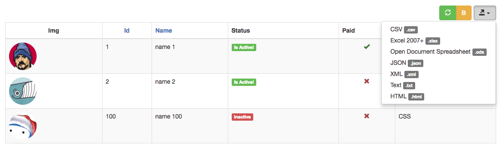

Exportable Widget for Yii2
==========================

[](https://packagist.org/packages/2amigos/yii2-exportable-widget) 
[](LICENSE.md)
[](https://packagist.org/packages/2amigos/yii2-exportable-widget) 
[](https://travis-ci.org/2amigos/yii2-exportable-widget)
[](https://scrutinizer-ci.com/g/2amigos/yii2-exportable-widget)




More than a simple widget, is a library. With this library you would be able to provide exporting capabilities to your 
Yii2 application whether you use our [GridView Library](https://github.com/2amigos/yii2-grid-view-library) (which is 
highly recommended) or your own. 

If you are using our [GridView Library](https://github.com/2amigos/yii2-grid-view-library), you will take the advantage 
of a predefined set of exporting formats that, in conjunction with the [ToolbarBehavior](https://github.com/2amigos/yii2-grid-view-library/blob/master/docs/behaviors/toolbar-behavior.md), 
you could export with a mere couple of configuration settings on your grid. The predefined exporting formats are: 

* **json**: Custom Spout writer by [2amigos](https://2amigos.us)
* **csv**: By [Spout library](http://opensource.box.com/spout/)
* **xlsx**: By [Spout library](http://opensource.box.com/spout/)
* **html**: Custom Spout writer by [2amigos](https://2amigos.us)
* **txt**: Custom Spout writer by [2amigos](https://2amigos.us)
* **xml**: Custom Spout writer by [2amigos](https://2amigos.us)
* **ods**: By [Spout library](http://opensource.box.com/spout/)

We have chosen the amazing [Spout library](http://opensource.box.com/spout/) for the great API it has and the ease of 
use. This library is not only [amazingly fast](http://opensource.box.com/spout/faq/) but also provided a mechanism that 
was really easy for us to create custom writers. 

Do not be scared by the amount of classes than this library contains, you will have to focus only on a 
[few of them](#library-components).


Installation
------------
The preferred way to install this extension is through [composer](http://getcomposer.org/download/).

Either run

```
php composer.phar require "2amigos/yii2-exportable-widget" "*"
```
or add

```json
"2amigos/yii2-exportable-widget" : "^2.0"
```

to the require section of your application's `composer.json` file.

> **Note** The reason why it starts at version 2.0 is that previously, this library was a jquery plugin with exportation 
> capabilities on the client side. The limitations of that library were obvious on our work, as most of our customers 
> required the full download of **all** data from master reports. We have not encountered yet a customer that only 
> wishes to download the visible page. Do not use any version prior 2.0 at least you want the jquery plugin instead 
> (not recommended) 

Library Components
==================

### ExportableButton Widget 

This button is responsible of rendering the dropdown button that will display the exporting options.

- [ExportableButton](widgets/exportable-button.md)

### ExportableAction Component

For your very own custom exportation. 

- [ExportableAction](actions/exportable-action.md)

### Services 

- [DownloadService](services/download-service.md) 
- [ExportableService](services/exportable-service.md)

### Helpful Guides 

- [How to Override Functionality](guides/how-to-override-behavior-functionality.md)

Contributing
------------

- [How to Contribute](contributing/how-to.md)
- [Clean Code](contributing/clean-code.md)

© [2amigos](http://www.2amigos.us/) 2013-2017
